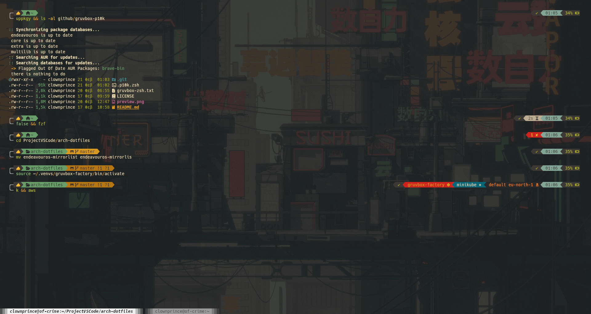

# Gruvbox-Themed Powerlevel10k Configuration

A **Powerlevel10k** theme with elements of the **Gruvbox** color palette for a clean and stylish terminal experience.

## 🎨 Preview


## 🚀 Installation

### 1. Install Powerlevel10k (if not installed)
```sh
git clone --depth=1 https://github.com/romkatv/powerlevel10k.git ~/powerlevel10k
echo 'source ~/powerlevel10k/powerlevel10k.zsh-theme' >>~/.zshrc
```
### 2. Clone the Repository
```sh
git clone https://github.com/clone-clownprince/gruvbox-p10k.git
```

### 3. Copy the Configuration File
```sh
cp gruvbox-p10k/.p10k.zsh ~/.p10k.zsh
```

### 4. Reload Your Terminal
```sh
source ~/.zshrc
```

## 🎨 Gruvbox Zsh Syntax Highlighting
This repository also includes a custom **zsh-syntax-highlighting** theme that matches the Gruvbox color palette.

### 🔧 Installation

1. **Ensure `zsh-syntax-highlighting` is installed.For more informations [here](https://github.com/zsh-users/zsh-syntax-highlighting/blob/master/INSTALL.md)**

2. **Copy/paste the contents of [gruvbox-zsh.txt](https://github.com/clone-clownprince/gruvbox-p10k/blob/master/gruvbox-zsh.txt) in your ~/.zshrc**

3. **Apply the changes**:
   ```sh
   source ~/.zshrc
   ```

## 📜 License
This project is licensed under the MIT License.

## ✨ Credits
- [Powerlevel10k](https://github.com/romkatv/powerlevel10k)
- [Gruvbox](https://github.com/morhetz/gruvbox)
- [zsh-syntax-highlighting](https://github.com/zsh-users/zsh-syntax-highlighting)

